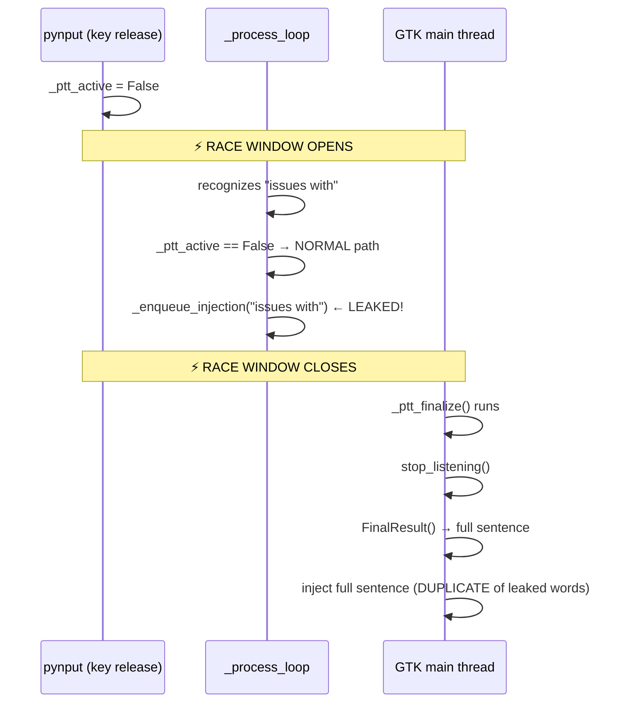

# PTT Race Condition — Word Prepending Bug

**Date**: 2026-02-27  
**Severity**: High  
**Status**: Root cause identified, fix proposed

## Symptom

Words from the **end** of a PTT utterance appear **before** the full sentence in the output.

| Said | Got |
|------|-----|
| "I am still having issues with push to talk" | `issues with I'm still having issues with push to talk` |
| "do we need these database files to be in the git repository surely they need to be ignored" | `need to do we need these database files to be in the git repository surely they need to be ignored` |

---

## Root Cause

A **race condition** between three threads during PTT key release:

```
Thread 1: pynput listener    → sets _ptt_active = False
Thread 2: _process_loop      → still running, sees _ptt_active == False
Thread 3: GTK main thread    → _ptt_finalize() hasn't run yet (queued via GLib.idle_add)
```

### The Race Window



### Code Path (main.py)

**`_on_ptt_release`** (line 332, pynput thread):
```python
self._ptt_active = False          # ← Immediate, no synchronization
GLib.idle_add(self._ptt_finalize) # ← Deferred to GTK loop
```

**`_process_loop`** (line 279, processing thread):
```python
if self._ptt_active:
    self._ptt_buffer.extend(text.split())  # PTT accumulate
else:
    self._enqueue_injection(text)          # ← LEAKS words during race window
```

During the gap between `_ptt_active = False` and `stop_listening()`, any
words recognized by Vosk bypass the PTT buffer and get injected immediately,
**then** appear again in the full PTT `FinalResult()`.

---

## Log Evidence

### Incident 1: "issues with" prepended (05:24:34–05:24:37)

```
05:24:34 [INFO] Starting listening... (C_RMS=True)
05:24:36 [INFO] Recognized: i'm            ← _ptt_buffer: [i'm]
05:24:36 [INFO] Recognized: still           ← _ptt_buffer: [i'm, still]
05:24:36 [INFO] Recognized: having          ← _ptt_buffer: [i'm, still, having]
                                             ← KEY RELEASED: _ptt_active = False
05:24:36 [INFO] Stopping listening...
05:24:37 [INFO] Recognized: issues with     ← _ptt_active is False → LEAKED
05:24:37 [INFO] Injecting: 'issues with'    ← ⚠️ INJECTED BEFORE FULL SENTENCE
05:24:37 [INFO] PTT raw: i'm still having issues with push to talk
05:24:37 [INFO] Injecting: 'I'm still having issues with push to talk'
```

**Result**: `issues with` + `I'm still having issues with push to talk`

### Incident 2: "need to" prepended (05:22:37–05:22:44)

```
05:22:44 [INFO] Recognized: surely they     ← _ptt_buffer accumulating
                                             ← KEY RELEASED: _ptt_active = False
05:22:44 [INFO] Stopping listening...
05:22:44 [INFO] Recognized: need to         ← LEAKED (normal injection path)
05:22:44 [INFO] Injecting: 'need to'        ← ⚠️ INJECTED BEFORE FULL SENTENCE
05:22:44 [INFO] PTT raw: do we need these database files...
05:22:44 [INFO] Injecting: 'do we need these database files...'
```

### Incident 3: "sentence" fragment leaked (05:24:22–05:24:27)

```
05:24:26 [INFO] Recognized: of the          ← _ptt_buffer accumulating
                                             ← KEY RELEASED
05:24:26 [INFO] Stopping listening...
05:24:27 [INFO] PTT raw: sentence           ← FinalResult got only "sentence"
```

Here Vosk's `FinalResult()` returned only the tail because the `_process_loop`
consumed most words via `Result()` before finalize. The streaming buffer had
`[i'm, still, getting, some, artifacts, in, the, front, of, the]` but was
NOT used because `FinalResult()` returned non-empty (just `"sentence"`).

---

## Additional Bug: FinalResult() vs Buffer Inconsistency

The original fix (this session) changed `_ptt_finalize` to use `FinalResult()`
as the authoritative source. However, **Vosk's `FinalResult()` only returns
words from the CURRENT Kaldi sentence** — if Vosk internally committed a
sentence boundary via `Result()` during the PTT session, those words are
already consumed and won't appear in `FinalResult()`.

This means:
- **Short utterances** (no sentence boundary): `FinalResult()` ✅ returns everything
- **Long utterances** (Vosk hits sentence boundary): `FinalResult()` only returns
  the LAST sentence fragment — earlier words are lost

The `_ptt_buffer` has ALL streamed words but at lower accuracy (partials).
`FinalResult()` has higher accuracy but may be incomplete.

---

## Proposed Fix

### Fix 1: Add `_ptt_releasing` Guard (Critical)

Introduce a `_ptt_releasing` flag that keeps `_process_loop` in PTT-accumulate
mode even after `_ptt_active` goes False, preventing the race window leak:

```python
# _on_ptt_release:
self._ptt_releasing = True   # guard: keep process_loop in PTT mode
self._ptt_active = False
GLib.idle_add(self._ptt_finalize)

# _process_loop (line 279):
if self._ptt_active or self._ptt_releasing:
    self._ptt_buffer.extend(text.split())
else:
    self._enqueue_injection(text)

# _ptt_finalize:
# ... do work ...
self._ptt_releasing = False  # clear guard after finalize complete
```

### Fix 2: Hybrid FinalResult + Buffer (Accuracy)

For accuracy, combine both sources intelligently:
- Use `FinalResult()` for the last sentence fragment (highest quality)
- Use `_ptt_buffer` words for anything before the last sentence boundary
- Detect sentence boundaries from `Result()` calls during the session

### Fix 3: Skip Injection During PTT Release (Minimal)

The simplest fix — suppress all normal injections while PTT settings are on:

```python
# _process_loop (line 282):
if self._ptt_active:
    self._ptt_buffer.extend(text.split())
elif not self.settings.get("push_to_talk", False):
    self._enqueue_injection(text)
# else: PTT mode but key not held — discard (waiting for next press)
```

This is the safest approach — in PTT mode, words should ONLY be output
via `_ptt_finalize`, never via the streaming path.

---

## Recommended Action

**Implement Fix 1 + Fix 3** together:
- Fix 3 prevents any leakage in PTT mode (belt)
- Fix 1 ensures buffer stays complete during the release transition (suspenders)

Then revisit Fix 2 for long-utterance accuracy in a follow-up.
